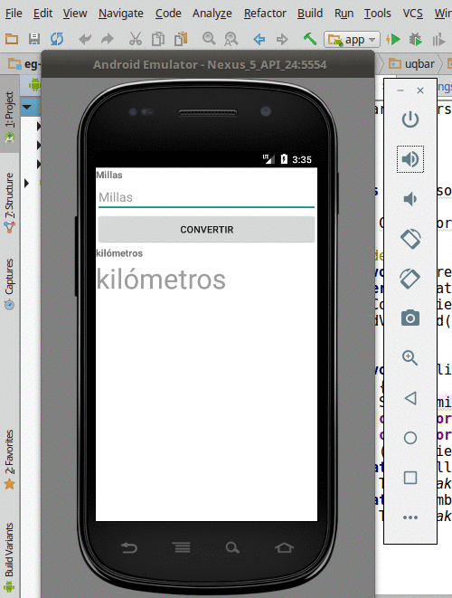

# Conversor de millas a kilómetros

 

Es la primera aplicación básica, nos sirve como ejemplo introductorio.

## Enunciado

El [enunciado](http://algo3.uqbar-project.org/material/ejemplos/dominios/conversor) plantea algunas variantes.

## El proyecto
Este proyecto está generado para

* Android Studio 3.0.0 (Septiembre 2017)
* con Gradle 3.0.0 (el que viene con Android Studio)
* para una SDK 26 (Nougat)

## La arquitectura MVC

* **La vista**: está definida en un .xml
* **El controller**: es el ConversorActivity
* **El modelo**: es un Conversor definido como Java Bean

No tenemos binding, así que el controller debe manualmente convertir los valores de la vista hacia el controller y viceversa, lo que incluye el manejo de errores.

 
